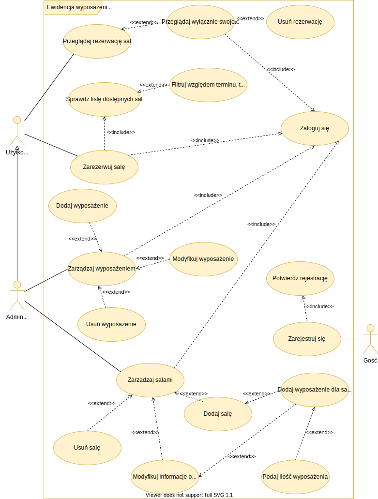
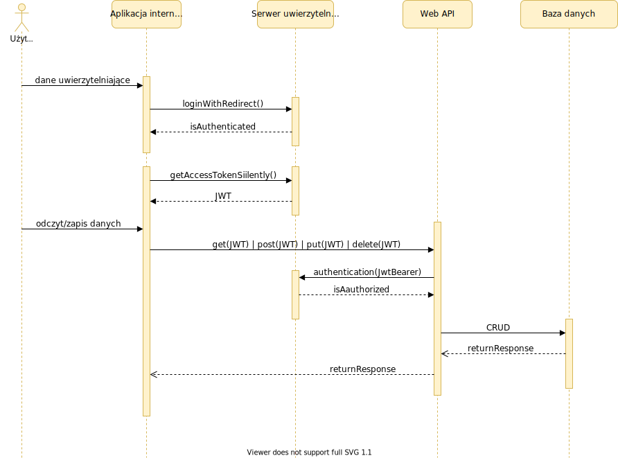

# POLITECHNIKA ŚLĄSKA
WYDZIAŁ AUTOMATYKI, ELEKTRONIKI I INFORMATYKI
## Projekt inżynierski
#### _System online ewidencji wyposażenia sal dydaktycznych na uczelni._

Autor: __Maciej Śliwa__
Kierujący pracą: __Dr inż. Robert Tutajewicz__
### Streszczenie
Celem pracy jest udokumentowanie procesu projektowania i implementacji aplikacji internetowej, która ma za zadanie w łatwy i bezpieczny sposób kolekcjonować, przechowywać i prezentować informacje o salach, ich wyposażeniu i dostępności
w placówce dydaktycznej. Stworzony system działa w architekturze klient-serwer z wykorzystaniem platform programistycznych React i ASP.NET Core, odpowiednio dla aplikacji internetowej i serwera REST. W realizacji rozwiązania używana jest również baza danych PostgreSQL oraz platforma identyfikacji Auth0. Opis projektu zawiera przegląd rynku rozwiązań służących ewidencji przedmiotów i pomieszczeń, przegląd popularnych technologii internetowych wraz z ich charakterystyką i argumentacją wyboru, a także teorię związaną z projektowanie aplikacji internetowych, kończąc na praktycznych rozwiązaniach i bezpieczeństwie danych użytkowników.

__Słowa kluczowe:__ `wyposażenie, ewidencja, asp.net core, react.js, aplikacja internetowa.`
### Use case diagram

### General sequence diagram
